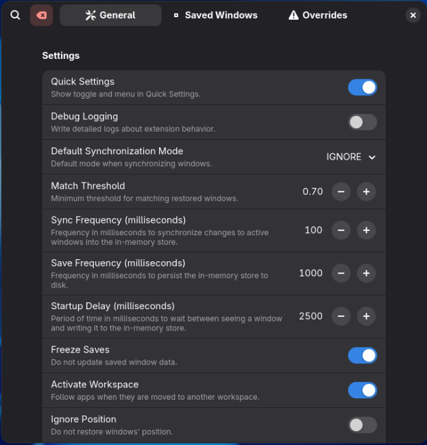

# gnome-shell-extension-SmartAutoMoveNG

Forked from https://github.com/khimaros/smart-auto-move

SmartAutoMoveNG
is a Gnome Shell extension which keeps track of all application windows and restores them to the previous position, size, and workspace on restart. Supports Wayland.

<p align="left">
  <a href="https://extensions.gnome.org/extension/8149/smart-auto-move-ng/" target="_blank">
    
  </a>
</p>

# Contributing

Pull requests are welcome.

To update the translation files run
`./smartautomoveng.sh translate` in the extensions directory after your code changes are finished. This will update the files in po folder.
Then [poedit](https://poedit.net/download){:target="_blank"} can be used to translate the strings. poedit can also be used to create new localization files.

## Screenshots

#### Quick Settings


The toggle in Quick Settings is connected to the "Freeze saves" switch of settings.

#### General



#### Saved Windows


#### Overrides


## Getting started

Most settings can be modified via the extension preferences dialog.

## Overtake settings from [smart-auto-move](https://github.com/khimaros/smart-auto-move) (the one this was forked from)

-   dump the settings from "smart-auto-move" to a file:

`$ dconf dump /org/gnome/shell/extensions/smart-auto-move/ > smart-auto-move.dconf`

-   load the dumped settings into "SmartAutoMoveNG":

`$ dconf load /org/gnome/shell/extensions/SmartAutoMoveNG/ < smart-auto-move.dconf`

### Defaults

The first step is to choose your **Default Synchronization Mode**: `IGNORE` or `RESTORE`. `IGNORE` will keep track of windows but will not restore any unless an **Override** with `RESTORE` behavior is created. `RESTORE` will keep track and restore all windows unless an **Override** with `IGNORE` behavior is created.

Next is to choose your global **Match Threshold**, the default works well for most use cases. a number closer to `0.0` will match windows with less similar attributes, whereas `1.0` requires an exact match.

Advanced users can also tune extension resource usage. adjust **Sync Frequency** (memory and CPU) and **Save Frequency** (disk I/O).

After you've dialed in your overrides, the learning apparatus can be paused. enable **Freeze Saves** to prevent changes to Saved Windows. N.B. this lose track of windows if their titles change.

### Overrides

To create an override, visit the **Saved Windows** tab.

To create an override for a specific window, click **OVERRIDE**.

To create an override for an entire application, click **OVERRIDE (ANY)**.

After you've created an override, visit the **Overrides** tab.

You can change the IGNORE/RESTORE behavior here for apps and windows.

For applications, a custom **Match Threshold** can be set.

## Limitations

LIMITATION: Terminals which include the current directory in the title may not reach the match threshold if they do not preserve the working directory across restarts. WORKAROUND: create a per-app override (see above) and set the threshold to a lower value, eg. `0.2`

LIMITATION: Multi-monitor is not well supported and may result in windows becoming "stuck". WORKAROUND: visit the "Saved Windows" tab in preferences and delete any stuck windows.

## Troubleshooting

If everything is horribly broken, clear your Saved Windows:

```
$ gnome-extensions disable SmartAutoMoveNG@lauinger-clan.de

$ dconf write /org/gnome/shell/extensions/SmartAutoMoveNG/saved-windows '{}'

$ gnome-extensions enable SmartAutoMoveNG@lauinger-clan.de
```

## Behavior

Because there is no way to uniquely distinguish individual windows from an application across restarts, SmartAutoMoveNG
uses a heuristic to uniquely identify them. This is primarily based on startup order and title. In cases where there are multiple windows with the same title, they are restored based on relative startup sequence.

Titles are matched using Levenstein distance. The match bonus for title is calculated based on `(title length - distance) / title length`.

## Settings

Most settings can be modified from the preferences GUI. This section documents all of the dconf values and is only recommended for advanced users.

Enable debug logging:

```
$ dconf write /org/gnome/shell/extensions/SmartAutoMoveNG/debug-logging true
```

Set the minimum window/title match threshold to 50%:

```
$ dconf write /org/gnome/shell/extensions/SmartAutoMoveNG/match-threshold 0.5
```

Set the window synchronization (update/restore) frequency to 50ms:

```
$ dconf write /org/gnome/shell/extensions/SmartAutoMoveNG/sync-frequency 50
```

Default to ignoring windows unless explicitly defined. Restore all windows of the gnome-calculator app, all firefox windows except for the profile chooser, and Nautilus only if the window title is "Downloads":
/

```
$ dconf write /org/gnome/shell/extensions/SmartAutoMoveNG/sync-mode "'IGNORE'"
$ dconf write /org/gnome/shell/extensions/SmartAutoMoveNG/overrides '{"gnome-calculator": [{"action":1}], "firefox": [{"query": {"title": "Firefox - Choose User Profile"}, "action": 0}, {"action": 1}],"org.gnome.Nautilus":[{"query":{"title":"Downloads"},"action":1}]}'
```

Default to restoring all windows, but ignore the firefox profile chooser and any nautilus windows:

```
$ dconf write /org/gnome/shell/extensions/SmartAutoMoveNG/sync-mode "'RESTORE'"
$ dconf write /org/gnome/shell/extensions/SmartAutoMoveNG/overrides '{"firefox": [{"query": {"title": "Firefox - Choose User Profile"}, "action": 0}], "org.gnome.Nautilus": [{"action":0}]}'
```

Show all saved firefox windows (N.B. `jq` will fail if window title contains `\`):

```
$ dconf read /org/gnome/shell/extensions/SmartAutoMoveNG/saved-windows | sed "s/^'//; s/'$//" | jq -C .Firefox | less -SR
```

There are example configs in the `examples/` dir which can be loaded (N.B. while extension is disabled) with:

```
$ dconf load /org/gnome/shell/extensions/SmartAutoMoveNG/ < ./examples/default-restore.dconf
```

You can backup your config (restore is the same as above):

```
$ dconf dump /org/gnome/shell/extensions/SmartAutoMoveNG/ > SmartAutoMoveNG.dconf
```

The gsettings tool can also be used to manipulate these values:

```
$ gsettings --schemadir ./SmartAutoMoveNG@lauinger-clan.de/schemas/ set org.gnome.shell.extensions.SmartAutoMoveNG sync-mode 'RESTORE'
```
